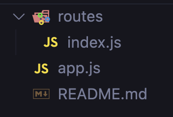
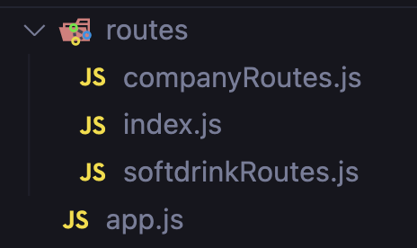

# Modular Routing & Template Engine

Pada lecture ini, kita akan belajar mengimplementasikan modular routing dan bagaimana caranya kita menampilkan data kkta dalam bentuk html.

## Modular Routing dengan expresss.Router

[Express routing](https://expressjs.com/en/guide/routing.html)

Routing adalah cara bagaimana sebuah endpoint dalam sebuah aplikasi menghandle request dari client.

contoh basic route:
```js
const express = require('express')
const app = express()

app.get('/', (req, res) => {
  res.send('hello world')
})
```
> disini, client me-request dengan method get ke endpoint '/', aplikasi menghandlenya dengan mengirimkan 'hello world'

```js
const express = require('express')
const app = express()
// app merupakan aplikasi expressnya


app.get('/', (req, res) => {
  res.send('hello world')
})

/** 
 * .get = method (http request method)
 * '/' = endpoint / route path
 * (req, res) => {} = handler
*/
```

Kita dapat membuat modular routing dengan memanfaatkan instance dari express yaitu `express.Router`. `express.Router` merupakan sebuah  middleware dan routing system dari express.
> middleware merupakan sebuah function yang akan dijalankan sebelum menjalankan suatu request ke server.

Langkah  - langkahnya:
- membuat file baru  (index.js) dalam sebuah folder bernama routes (plural)

- dalam file index routes, kita gunakan instance `express.Router`

```js
const express = require('express')
const router = express.Router()

router.get('/', (req, res) => {
  res.send('hello world')
})
// disini kita hanya memindahkan endpoint '/' dan handlernya ke dalam index routes

module.exports = router
// lalu disini kita export module router file index routes
```
- lalu, di dalam file app.js atau file utama kita panggil module routenya

```js
const express = require('express')
const app = express()
const port = 3000
const routes = require('./routes/index');

app.use("/", routes)
// disini kita mendefine routes yang kita pakai

app.listen(port, () => {
  console.log(`Example app listening on port ${port}`)
})
```

Lalu, bagaimana apabila kita mau lebih modular lagi?
- kita bisa menambahkan file didalam folder routes, untuk menghandle endpoint-endpoint agar lebih modular. Contoh kita memiliki endpoint `/companies` dan `/softdrinks`
- kita bisa menambahkan 2 file "companyRoute" & "softdrinkRoutes"

- di dalam file companyRoute misalnya, kita lakukan hal yang sama untuk buat handlernya

```js
const express = require('express')
const router = express.Router()

router.get('/', (req, res) => {
  res.send('hello world')
})

module.exports = router
```

- namun, didalam file index routes nya, kita define seperti pada app

```js
const express = require('express')
const router = express.Router()
const companyRoutes = require('./companyRoutes');

router.use("/companies", companyRoutes)

module.exports = router
```

- maka, semua handler yang ada di dalam file company menjadi memiliki `/companies` di depannya


## Template Engine dengan EJS

[Express template engine](https://expressjs.com/en/guide/using-template-engines.html)
[Website EJS](https://ejs.co/)

Template engine merupakan tools yang dapat kita gunakan untuk merender sebuah file template static dalam aplikasi kita. File template tersebut akan dirender sebagai sebuah file html di server kita (server-side rendering)

> untuk dapat menggunakan template engine, kita harus menginstall package 'ejs'

Untuk merender file html di server kita menggunakan ejs, ada 2 hal yang kita butuhkan:
1. folder `views` => jika kita menggunakan ejs, dia akan otomatis mencari semua file yang ada di dalam folder `views`  (camelCase, plural)
2. set view engine dengan cara menambahkan middleware :
```js
app.set('view engine', 'ejs')
```
untuk dapat menggunakan ejs ini, harus kita set  terlebih dahulu view engine apa yang akan kita pakai

Maka, di file app.js akan berbentuk seperti ini:

```js
const express = require('express')
const app = express()
const port = 3000
const routes = require('./routes/index');

app.set("view engine", "ejs")
// disini kita mendefine template engine yang akan kita pakai.

app.use("/", routes)
// disini kita mendefine routes yang kita pakai

app.listen(port, () => {
  console.log(`Example app listening on port ${port}`)
})
```

> karena `app.set()`  itu  adalah sebuah middleware, maka kita simpan sebelum handler request server, agar semua handler yang kita buat dapat memanfaatkan template engine tersebut.

setelah kita define set  view enginenya, maka hal selanjutnya yang akan kita lakukan adalah memakai view engine tersebut, caranya adalah sebagai berikut:

```js
// didalam handler requestnya, dapat kita tambahkan view enginennya
// contoh ini di file companyRoutes

const express = require('express')
const router = express.Router()

// gunakan template engine ejs dengan keyword 'render'

router.get('/', (req, res) => {
  res.render('home')
})
// 'home' ini mengacu pada nama file yang
// akan di render di folder 'views'

module.exports = router
```

kita juga dapat mengirim data ketika render file ejs, sehingga nantinya `home.ejs` dapat mempunyai data didalamnya

```js
// didalam handler requestnya, dapat kita tambahkan view enginennya
// contoh ini di file companyRoutes

const express = require('express')
const router = express.Router()

// gunakan template engine ejs dengan keyword 'render'

router.get('/', (req, res) => {
  res.render('home', { data })
})

// kirim data pada parameter ke-2 dan dibungkus object

module.exports = router
```

> selain itu kita juga dapat menggunakan scripplet ejs dalam file ejs tersebut

di file home.ejs
```html
<!DOCTYPE html>
<html lang="en">
<head>
  <meta charset="UTF-8">
  <meta http-equiv="X-UA-Compatible" content="IE=edge">
  <meta name="viewport" content="width=device-width, initial-scale=1.0">
  <title>Document</title>
</head>
<body>
  <!-- sama seperti html biasa, bedanya, disini kita bisa memakai scripplet ejs -->

  <!-- scripplet ejs harus ditutup per baris -->
  <% data.forEach((el) => { %>
    <h3><%= el.name %></h3>
    <p><%= el.description %></h3>
  <% }) %> 
</body>
</html>
```

lebih lengkap tentang scripplet ejs: [klik disini lalu scroll bagian 'tags'](https://ejs.co/#docs)